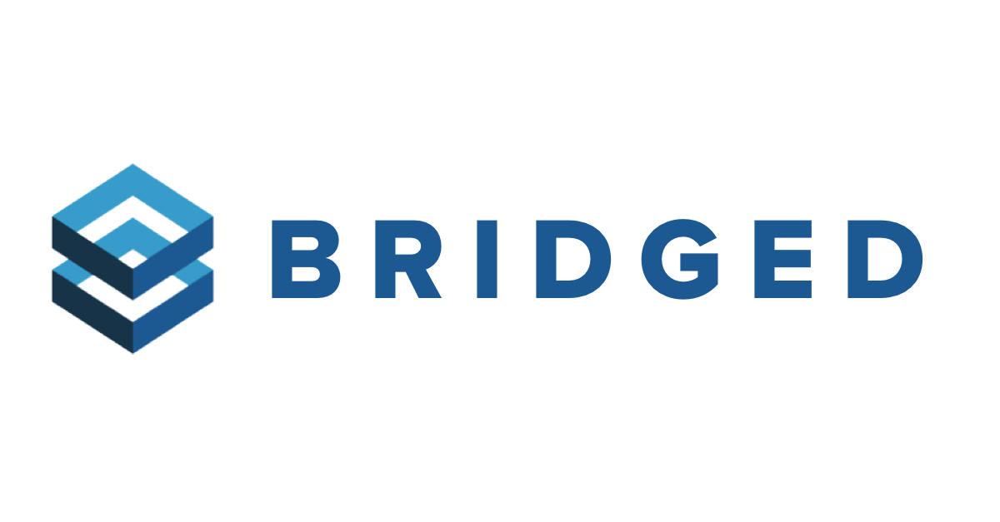

## Bridged App

Bridged is a link shortener application that will redirect long website URLs. Project was built with Meteor, ReactJS, and MongoDB.

[View Live Demo](https://bridged-app.herokuapp.com/)

## 🚀 Quick start

1.  **Project Setup**

    Clone the project and install the dependencies

    ```shell
    git clone https://github.com/davidkim10/bridged-app
    cd bridged-app
    npm install
    ```

2.  **Run Project**

    ```shell
    npm start
    ```

    View app on `http://localhost:3000`

## ⁉️ Frequently Asked Questions

- **What is Meteor**

  Meteor is an open-source isomorphic JavaScript web framework written using Node.js. Meteor is designed to build scalable web, mobile and desktop apps quickly, efficiently, and at scale. <a href="https://www.meteor.com/" target="_blank">Learn More</a>

- **What is ReactJS**

  React is an open-source, front end, JavaScript library for building user interfaces or UI components.
  <a href="https://reactjs.org/" target="_blank">Learn More</a>

- **What is MongoDB?**

  MongoDB is a cross-platform document-oriented database program. Classified as a NoSQL database program, MongoDB uses JSON-like documents with optional schemas. <a href="https://www.mongodb.com/" target="_blank">Learn More</a>
